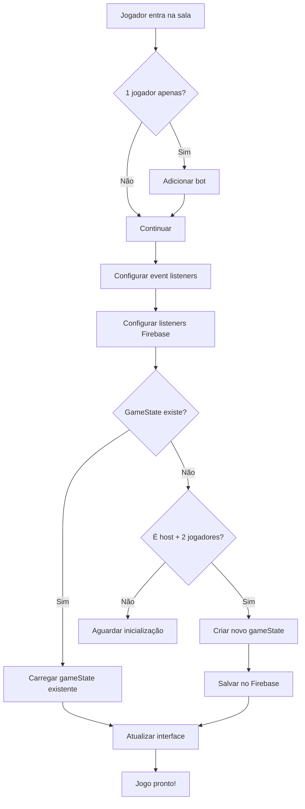

# 🔧 Correção: Sistema de Início de Partida

## 🐛 Problema Identificado

Quando o jogador clicava em "Play", o bot era carregado mas a partida não iniciava. O problema estava na **ordem de inicialização dos componentes**.

### Fluxo Anterior (com problema):

```
1. ❌ setupGameListeners() - configura listeners
2. ❌ initializeGameState() - cria gameState
3. ❌ setupEventListeners() - configura botões
```

**Problemas:**
- Listeners configurados ANTES do gameState existir
- Não havia verificação se gameState já existia
- O listener não era disparado na primeira criação
- Interface não era atualizada após criar gameState

---

## ✅ Correções Implementadas

### 1. **Reordenação do Fluxo de Inicialização**

```javascript
// NOVO FLUXO CORRETO:
1. ✅ setupEventListeners() - configura botões primeiro
2. ✅ setupGameListeners() - configura listeners do Firebase
3. ✅ Verificação de gameState existente
4. ✅ initializeGameState() - só cria se não existir
```

### 2. **Verificação de GameState Existente**

```javascript
// Verificar se gameState já existe
const gameStateSnapshot = await dbRef.room(roomId).child('gameState').once('value');
const existingGameState = gameStateSnapshot.val();

if (existingGameState) {
    console.log('✅ GameState já existe, carregando...');
    handleGameStateUpdate(existingGameState);
} else {
    // Inicializar apenas se não existir
    await initializeGameState();
}
```

### 3. **Prevenção de Duplicação**

```javascript
async function initializeGameState() {
    // Verificar se gameState já existe para evitar duplicação
    const gameStateCheck = await dbRef.room(roomId).child('gameState').once('value');
    if (gameStateCheck.val()) {
        console.log('⚠️ GameState já existe, não será recriado');
        return;
    }
    
    // ... resto da lógica
}
```

### 4. **Atualização Forçada da Interface**

```javascript
// Após criar gameState, forçar atualização
await dbRef.room(roomId).child('gameState').set(gameState);

// Atualizar status da sala
await dbRef.room(roomId).update({
    status: 'playing',
    gameStartedAt: firebase.database.ServerValue.TIMESTAMP
});

// Disparar atualização da interface
handleGameStateUpdate(gameState);
```

### 5. **Logs Detalhados**

Adicionados logs em todas as etapas críticas:

```javascript
- 🔍 Verificando se gameState já existe...
- ✅ GameState válido, atualizando interface...
- 🎯 Turno: { currentTurn, isMyTurn, myId }
- 🎨 Renderizando pilhas dos jogadores...
- 📚 Pilha de você: { cartas, coletadas, topCard }
- ✅ Renderização de pilhas concluída
```

---

## 🎮 Fluxo Completo Corrigido

### Ao Entrar na Sala:



### Ao Criar GameState:

```
1. ✅ Verificar se já existe (prevenir duplicação)
2. ✅ Gerar cartas (10 de cada estilo = 20 total)
3. ✅ Embaralhar cartas
4. ✅ Distribuir entre jogadores (10 cada)
5. ✅ Sortear primeiro jogador
6. ✅ Salvar estado no Firebase
7. ✅ Atualizar status da sala para 'playing'
8. ✅ Disparar atualização da interface
9. ✅ Renderizar pilhas de cartas
10. ✅ Iniciar timer de turno
```

---

## 📊 Estado do Jogo Criado

```javascript
gameState = {
    status: 'playing',
    players: {
        [player1Id]: {
            pile: [10 cartas embaralhadas],
            collectedStyles: []
        },
        [player2Id]: {
            pile: [10 cartas embaralhadas],
            collectedStyles: []
        }
    },
    currentTurn: 'player1Id ou player2Id (aleatório)',
    lastRevealedCard: null,
    lastAction: timestamp,
    turnStartTime: timestamp
}
```

### Estrutura de Cada Carta:

```javascript
{
    id: número único,
    symbol: 'heart' | 'star' | 'diamond' | ...,
    estilo_real: 'neon-circuit' | 'arcane-sigil' | ..., // Dono verdadeiro
    dono_atual: playerId, // Quem possui temporariamente
    estado: 'oculta' | 'revelada',
    posicao_pilha: número
}
```

---

## 🎯 Mecânica da Partida

### Revelar Carta do Topo:

1. **Jogador clica na carta do topo** da sua pilha
2. Carta é revelada (muda para `estado: 'revelada'`)
3. Sistema verifica `estilo_real` da carta

#### Se for do MEU estilo:
- ✅ Carta é removida da pilha
- ✅ Carta vai para `collectedStyles`
- ✅ **Turno é mantido** - joga novamente!
- 📊 Score incrementa
- 💬 Mensagem: "✅ Carta sua! Continue jogando"

#### Se for do estilo do OPONENTE:
- ❌ Carta é removida da minha pilha
- 📤 Carta vai para `collectedStyles` do oponente
- 📥 Recebo uma carta aleatória da pilha do oponente
- 🔄 **Turno passa** para o oponente
- 💬 Mensagem: "📤 Carta do oponente! Turno passado"

### Condição de Vitória:

- 🏆 Primeiro jogador a coletar **10 cartas** do seu estilo vence
- Sistema verifica após cada jogada

### Timer de Turno:

- ⏱️ 30 segundos por turno
- ⚠️ Alerta visual aos 5 segundos
- 🤖 Revelação automática ao esgotar tempo

### Bot:

- 🤖 Joga automaticamente quando é seu turno
- ⏳ Delay de 1.5s a 3s (simular pensamento)
- 🎲 Mesma lógica do jogador humano

---

## 🧪 Como Testar

### 1. Entrar na Sala:
```
- Criar sala no lobby
- Clicar em "Play"
- Bot deve ser adicionado automaticamente
```

### 2. Verificar Logs no Console:
```
✅ Bot adicionado à sala
🔄 Recarregando dados da sala após adicionar bot
👥 Contagem atual de jogadores: 2
🔧 Configurando event listeners...
🔧 Configurando listeners do Firebase...
🔍 Verificando se gameState já existe...
🎮 Iniciando novo jogo como host...
💾 Salvando estado no Firebase...
✅ Estado do jogo inicializado com sucesso!
🔄 Disparando atualização inicial da interface...
🎨 Renderizando pilhas dos jogadores...
✅ Renderização de pilhas concluída
```

### 3. Interface Esperada:
```
- 🎯 Indicador de turno: "🎯 Sua vez!" ou "⏳ Vez do oponente"
- 🎴 Duas pilhas de cartas visíveis
- 📊 Contador de cartas (10/10 inicialmente)
- 📊 Contador de coletadas (0/0 inicialmente)
- ⏱️ Timer de turno (30s)
- 🃏 Carta do topo clicável (quando seu turno)
```

### 4. Testar Jogada:
```
- Clicar na carta do topo
- Carta deve ser revelada
- Sistema processa e atualiza estado
- Bot joga automaticamente quando é seu turno
```

---

## 📝 Arquivos Modificados

### `/public/js/game.js`

**Mudanças principais:**
1. Reordenação de `initializeGame()`
2. Adição de verificação de gameState existente
3. Prevenção de duplicação em `initializeGameState()`
4. Atualização forçada da interface após criar gameState
5. Logs detalhados em todas as funções críticas
6. Melhoria em `handleGameStateUpdate()`
7. Melhoria em `renderPlayerPiles()`

---

## 🎉 Resultado

Agora quando o jogador clicar em "Play":

1. ✅ Bot é adicionado automaticamente
2. ✅ Listeners são configurados na ordem correta
3. ✅ GameState é criado apenas uma vez
4. ✅ Interface é atualizada imediatamente
5. ✅ Pilhas de cartas são renderizadas
6. ✅ Partida inicia corretamente
7. ✅ Turno é gerenciado
8. ✅ Bot joga automaticamente

**A partida está pronta para jogar! 🎮**
